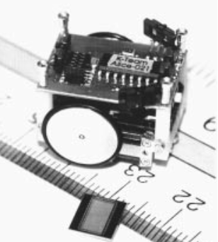
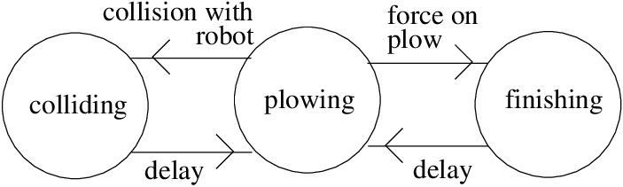
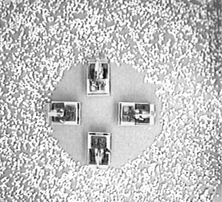
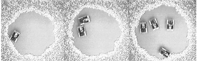
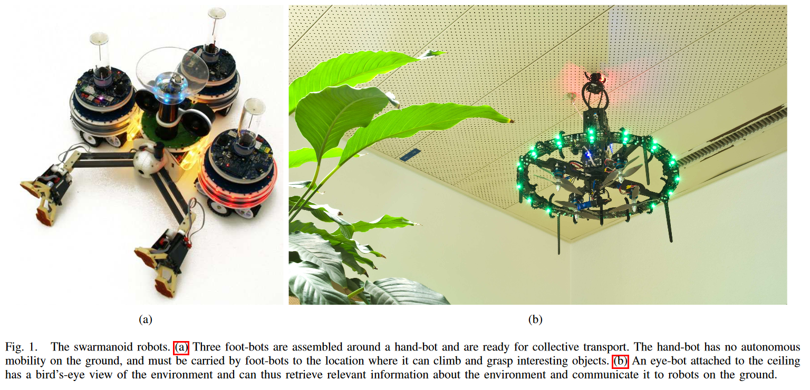
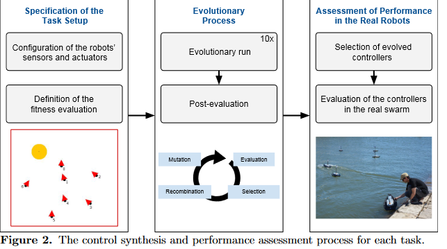

# History
[Source](https://prezi.com/rrkte7ala-71/history-of-swarm-robot/)

## Collective Robotics (Kube & Zhang 1993)
> Kube, C. R., & Hong Zhang. (1993). 
> Collective Robotics: From Social Insects to Robots. Adaptive Behavior, 2(2), 189–218. 
> doi:10.1177/105971239300200204 

### 资源
- [视频](./ualbert/ual.mp4)
- [论文](./ualbert/kube1993.pdf)
### 特点
- 没有明确的通信
- 基于虫群行为

### 简要
#### 生肉
Achieving tasks with multiple robots will require a control system that is both simple and scalable as the number of robots increases. Collective behavior as demonstrated by social insects is a form of decentralized control that may prove useful in controlling multiple robots. Nature’s several examples of collective behavior have motivated our approach to controlling a multiple robotsystem using a group behavior. Our mechanisms, used to invoke the groupbehavior, allow the system of robots to perform tasks without centralizedcontrol or explicit communication. We have constructed a system of five mobile robots capable of achieving simple collective tasks to verify the results obtained in simulation. The results suggest that decentralized control without explicit communication can be used to perform cooperative tasks requiring a collective behavior.
#### 熟肉
多机器人协同作业需要一个兼顾简单与可拓展的系统. 由虫群所表现的集体行为, 是以一种去中心的控制形式呈现的, 这对控制多个机器人也许是很有用的. *自然*中有几个集体行为的例子启发了我们使用这种群体性为来控制一个多机器人系统. 我们的工程师通过使用群体行为, 使得多机器人可以在没有中心控制和明确通信的情况下协同作业. 我们构建了一个由五个移动机器人所组成的系统, 这个系统可以完成简单的集体任务, 从而验证了仿真结果. **结果表明，在没有显式通信的情况下，去中心的控制可以用于执行需要集体行为的协同作业。**

## Distributed Odor Source Localization (Hayes 2002)
> Hayes, A. T., Martinoli, A., & Goodman, R. M. (2002). 
> Distributed odor source localization. IEEE Sensors Journal, 2(3), 260–271. 
> doi:10.1109/jsen.2002.800682 
### 资源
- [论文](./hayes/hayes2002.pdf)
### 特点
- 基于气味的简单行为
- 蜂群模式定位气味源
- 相互交流的协作模式
- 环境监测
### 简要
#### 生肉
This paper presents an investigation of odor localization by groups of autonomous mobile robots. First, we describe a distributed algorithm by which groups of agents can solve the full odor localization task. Next, we establish that conducting polymer based odor sensors possess the combination of speed and sensitivitynecessary to enable real world odor plume tracing and we demon-strate that simple local position, odor, and flow information, tightly coupled with robot behavior, is sufficient to allow a robot to localizethe source of an odor plume. Finally, we show that elementary communication among a group of agents can increase the efficiency of the odor localization system performance.
#### 熟肉
本文研究了自主移动机器人群体的气味定位问题. 首先, 我们描述了一种分布式算法, 通过这种算法, 一组机器人可以解决气味定位任务. 接下来, 我们建立拥有良好反应速度和敏感性的聚合导体气味传感器, 这让我们可以跟踪现实世界的气味流动. 我们证明, 简单的局部位置和气味与信息交流, 加之以机器人之间的密切配合, 足以定位气味的来源. 最后我们展示了作业机器人之间基本的交流可以提升定位系统的效率.

## Blind Bulldozing: Multiple Robot Nest Construction(Parker, Kube, Zhang 2003)
> DOI: 10.1109/IROS.2003.1248950 

### 资源
- [论文](./BlindBulldozing/blind_bulldozing.pdf)

### 特点
- 协同建筑

### 摘要

#### 生肉
In this paper, we present a collective, or swarm construction algorithm to control robotic bulldozers in the creation of a work site. Predictions about robotic missions to the planet Mars have described such site preparation as essential to the success of later mission objectives, such as the construction of solar arrays, etc. This algorithm was based on a behaviour observed in a particular species of ant called "blind bulldozing". We developed a mathematical model of blind bulldozing using a unique approach based on Markov chains. Robot bulldozers were developed and used to test the algorithms in our laboratory. The team of robots was found to be successful at clearing an open area out of field of rocks. Our robots' behaviour also agreed with the predictions of our model. This work is significant because it demonstrated the viability of blind bulldozing and represents the first time, to our knowledge, that a multiple robot system has carried out a form of the general construction task outside of simulation.
#### 熟肉
在这篇论文中, 我们展示了一个控制机器人推土机创造一个工作站的蜂群(或者说协作)建筑算法. 根据预测, 这样的任务在将来的火星探索中至关重要, 比如太阳能板建造等任务. 这种算法基于一种被称为"**盲目推土(Blind Bulldozing)**"的动物群体行为. 我们基于马尔科夫链, 构建了它的数学模型. 我们实验室里的机器人推土机可以用来验证这个算法, 并且使机器人队伍成功的地在岩石中清理出一块空地. 我们的机器人的行为也符合我们模型的预测. 这项工作意义重大. 因为它证明了**盲目推土算法**的可行性. 据我们了解, 这是第一次多个机器人系统在模拟之外执行一种形式的一般施工任务.

### 展示

## Distributed ControlArchitecture for Self-reconfigurable Manipulators(A. Turetta G. Casalino A. Sorbara 2008)
> Turetta, A., Casalino, G., & Sorbara, A. (2008). 
> Distributed Control Architecture for Self-reconfigurable Manipulators. The International Journal of Robotics Research, 27(3-4), 481–504. 
> doi:10.1177/0278364907085565 
### 资源
[论文](./atron/turetta2008.pdf)

### 特点
- 自重组
- 高兼容性
### 摘要
#### 生肉
In recent years self-reconfigurable modular robots have gained in-creasing interest from part of the international robotic community.Although recent robots of this type are characterized by advanced electro-mechanical designs, the development of their supporting control techniques have only registered strong results in the field of locomotion problems, while the manipulation capabilities of existingsystems still appear to be quite limited. Aiming to provide a contribution along this latter direction, in this paper we propose a com-putationally distributed technique for controlling the motion of anytree-structured chain resulting from reconfiguration in its operationalspace. The presented strategy, which could actually be adopted whendealing with any kind of chain-based modular robotic system, turns out to be particularly well suited to self-reconfigurable structures forthree main reasons: 
1. it is not based on any explicit role assignment; all of the modules can be added, removed or exchanged online as re-quired, with no impact on the overall control architecture.
2. eachmodule has only a very limited set of local information that must beknown a priori and can be totally unaware of the remaining part ofthe chain
3. no external centralized controller is necessary

basic local processing and communication units onboard every module and a simple man–machine interface providing high-level commandsare enough. A global self-coordinating behavior is automatically exhibited by the proposed technique at power-on or immediately after any configuration change as the result of a number of repeated data exchanges, performed online along the chain at every sampling interval. Although achievable performances depend on the availablecommunication bandwidth, the convergence towards a final positionerror of zero is, however, always guaranteed. Moreover, because thecomputational burden required by every module is extremely light,the proposed technique represents an effective control solution that can be easily implemented onboard many of the low-cost and smallcontrol platforms available on existing self-reconfigurable robots.

#### 熟肉
近年来, **自重构模块化机器人**越来越受到国际机器人界的关注. 尽管这种类型的机器人有着先进的机电设计, 但它们使用的控制技术的发展只在运动问题领域取得了显著的成果, 而现有系统的操作能力似乎仍然很有限. 为了在后一个方向做出贡献，本文提出了一种分布式计算的方法来控制任意树状链的运动. 我们提出的这个策略, 实际上可以用于处理任何类型的基于链的模块化机器人系统，它是这么的适合自重构结构, 主要基于以下的三个主要原因:

1. 它不基于任何明确的角色分配: 所有模块都可以根据需要在线添加, 删除或交换, 而不会影响整个控制体系结构. 

2. 每个模块只有一组非常有限的本地信息: 这些信息必须是预先知道的, 并且可以完全不知道链的其余部分. 

3. 不需要外部集中控制器, 只需要每个模块上都有基本的本地计算和通信单元, 以及一个发出高级命令的简单人机交互界面. 

在开机之后, 或者修改了设定, 由于许多重复的数据交换, 在每一个在线链的采样间隙时, 就会立刻做出全局的自我协调行为. 虽然实际性能取决于可用的通信带宽, 但可以保证最终定位误差收敛为零. 此外, 由于每个模块所需的计算负载非常轻, 因此我们提出的技术代表了一种有效的, 可以在现有的自重构机器人所使用的许多**低成本**和**小型控制平台**上轻松实现的, 这么一种控制解决方案.

### 展示
- [视频_youtube](https://www.youtube.com/watch?v=SYizuooEs7s&list=PL0801B819ED037AA0)
- [视频_local_arm](./atron/arm.mp4)

## KMel(2011)
一个飞行机器人模组
### 资源
[油管频道](https://www.youtube.com/user/TheDmel)

### 演示
[机器人演奏音乐](./keml/Flying%20Robot%20Rockstars.webm)

## Swamanoid(2011)
### 特点
- 分工, 异质性
### 资源
[Swarmanoid: A Novel Concept for the Study of Heterogeneous Robotic Swarms](./swarmanoid/Swarmanoid_A_Novel_Concept_for_the_Study_of_Hetero.pdf)
> DOI: 10.1109/MRA.2013.2252996

### 摘要
#### 生肉
The field of swarm robotics currently lacks methods and tools with which to study and leverage the heterogeneity that is present in natural systems. To remedy this deficiency, we proposes warmanoid, an innovative swarm robotics system composed of three different robot types with complementaryskills:foot-bots are small autonomous robots specialised inmoving on both even and uneven terrains, capable of self-assembling and of transporting either objects or other robots;hand-bots are autonomous robots capable of climbing somevertical surfaces and manipulating small objects; eye-bots are autonomous flying robots which can attach to an indoor ceiling, capable of analysing the environment from a privileged position to collectively gather information in accessible to foot-bots and hand-bots (see Figure 1).
#### 熟肉
集群机器人领域现在缺乏研究与利用自然界中普遍存在的**异质性**的方法和工具, 为了弥补这个不足, 我们提出了**swamanoid**, 这是一种创新的群机器人系统, 由三种不同类型的机器人组成, 它们具有互补的技能: 足部机器人是小型自主机器人, 可以在各种地形上移动, 能够自组装和运输对象或其他机器人; 手部机器人有能力攀登一些垂直的表面, 操纵小物体; 眼部机器人可以自主飞行, 附着在室内天花板, 能够从特殊地位, 手机来自足部机器人和手部机器人信息, 并且分析环境(见图1).

## Kiva(Amazon 2013)
Kiva System, 或者说是[Amazon Robotics](https://en.wikipedia.org/wiki/Amazon_Robotics)是亚马逊开发一套仓库机器人系统. 
### 介绍
#### 生肉
Traditionally, goods are moved around a distribution center using a conveyor system or by human operated machines (such as forklifts). In Kiva's approach, items are stored on portable storage units. When an order is entered into the Kiva database system, the software locates the closest automated guided vehicle (bot) to the item and directs it to retrieve it. The mobile robots navigate around the warehouse by following a series of computerized bar-code stickers on the floor. Each drive unit has a sensor that prevents it from colliding with others. When the drive unit reaches the target location, it slides underneath the pod and lifts it off the ground through a corkscrew action. The robot then carries the pod to the specified human operator to pick the items.

The system is much more efficient and accurate than the traditional method of having human workers traveling around the warehouse locating and picking items.
#### 熟肉
在以前, 货物都是围绕着一个分布中心, 使用流水线或者人操纵的集器来移动的. 在Kiva中, 货物被储存在可移动的货架单元上. 当一个订单进入Kiva数据系统, 软件会定位最近的的机器人, 将其匹配并且引导机器人去获取这个货物. 这些移动机器人由一系列贴在地板上的条形码来导航. 每个驱动单元都有一个传感器, 防止它与其他设备发生碰撞. 当驱动单元到达目标位置时, 它就滑到货架下面, 通过螺旋动作将货架从地面顶起. 之后, 机器人把货架送到指定的操作员那里去拣货.

该系统比传统的让工人在仓库周围走动, 定位, 挑选物品的方法更加有效和准确。
> 摘自维基百科

### 展示
- [视频]()

## Evolution of Collective Behaviors for a Real Swarm of Aquatic Surface Robots(Duarte 2016)

> DOI: 10.1371/journal.pone.0151834
### 特点
- 神经网络
- 真实环境
### 资源
[论文](./auqa/1511.03154.pdf)
### 摘要
#### 生肉
Studies on swarm robotics systems have shown the potential of large-scale multirobot systems based on decentralized control. So far, studies have been mostly conducted in simulation, and the few that have been conducted on real robots have been confined to laboratory environments. In this paper, we present experiments with an autonomous swarm of up to ten aquatic surface robots, conducted in a real and uncontrolled environment. We evolve neural network-based controllers in simulation for canonical swarm robotics tasks, and then assess their performance on real hardware. Our results show that the evolved controllers generally transfer well to the real robots, displaying a similar performance to that obtained in simulation, and similar behavior patterns. We also show that the evolved control maintain key properties of swarm intelligence-based control, namely scalability, flexibility, and robustness. We conclude with a proof-of-concept experiment in which the swarm performs an environmental monitoring task by combining multiple evolved controllers.
#### 熟肉
对集群机器人系统的研究已经表明了基于去中心控制下的大规模多机器人系统的潜力. 不过到目前为止, 研究主要是在模拟环境中进行的, 少量基于真实机器人上的研究也局限于实验室环境. 在这篇论文中, 我们开发了一个由多达10个水上机器人组成的集群的实验, 在一个真实的和不受控制的环境中进行. 我们进化基于神经网络的控制系统来模拟典型的集群机器人任务, 然后在真实的硬件上评估它们的性能. 结果表明, 进化后的控制系统能很好地传递给真实机器人，表现出与仿真相似的性能和相似的行为模式. 我们还证明了进化后的控制系统保持了群智能控制的关键特性, 即可扩展性, 灵活性和鲁棒性. 最后, 我们用一个概念验证实验作为结论, 在这个实验中, 群体通过组合多个进化控制器来执行环境监控任务.

